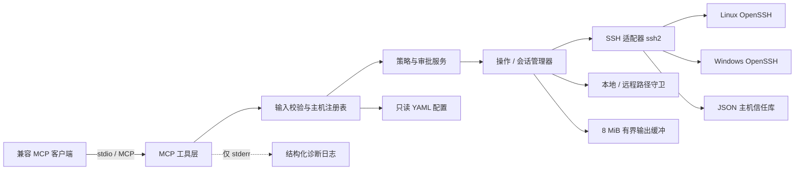
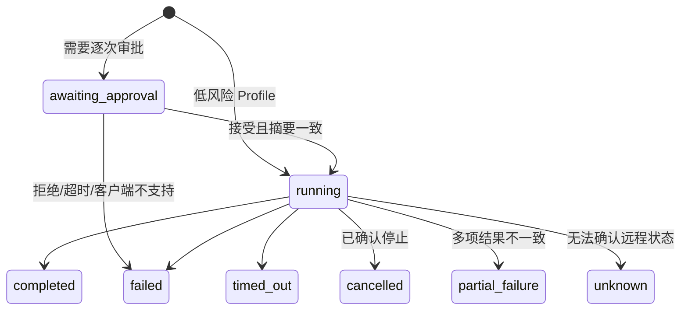
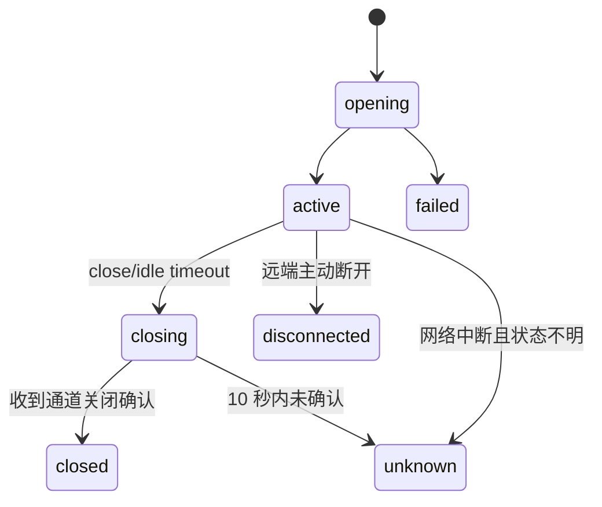

# 技术设计：SSH MCP

> 状态：已确认（2026-07-17）  
> 日期：2026-07-17  
> 对应规格：[SSH MCP Spec](../specs/2026-07-17-ssh-mcp-spec.md)

## 1. 设计目标

本设计把已确认的行为规格落实为一个本地运行、仅通过 MCP stdio 暴露能力的 SSH 服务。它面向单个开发者管理 1–10 台预先登记的开发或测试主机，支持 Linux/POSIX Shell、Windows/PowerShell、单次命令、持久终端、文件与目录传输及少量多主机协作。

核心目标是：

- 所有主机、认证方式、允许路径和低风险规则都由用户在 MCP 会话外预先配置。
- 未登记目标、非法参数和不支持的客户端能力在产生副作用前失败。
- 首次主机指纹由用户确认；已信任指纹变化时无条件拒绝。
- 只有完整匹配结构化低风险配置的操作可以自动执行；其余操作绑定精确内容进行一次性审批。
- 长任务、终端和传输都具有可查询状态、增量输出、超时、取消和不确定状态。
- 远程 Linux 与 Windows 使用各自声明的 Shell 与路径语义，不做跨平台翻译。

## 2. 范围与设计边界

### 2.1 范围内

- 本地 MCP stdio 服务。
- 只读 YAML 配置、JSON 主机信任库、进程内会话与操作状态。
- SSH Agent、Windows Pageant 或本地私钥文件认证。
- `ssh2` 提供的 SSH exec、PTY Shell 和 SFTP。
- 1–10 台显式主机目标，支持并行或请求顺序执行。
- MCP 表单 Elicitation 用于风险审批和首次主机信任。

### 2.2 范围外

- 生产主机、动态主机地址、密码/MFA/密钥生命周期。
- HTTP 业务 API、独立交互式 CLI、Web 或桌面管理界面。
- SSH 隧道、端口/X11/代理转发、跳板编排。
- 自动重试、跨主机事务、自动回滚、服务重启恢复。
- 文件续传、元数据保留、符号链接复制或跟随。
- 多用户、角色、租户、长期审计和合规报表。

包的可执行入口只用于被 MCP 客户端以 stdio 子进程启动，不定义面向用户的 CLI 命令集。

## 3. 已确认的重大技术决策

### 3.1 语言与运行时

候选方案：

- TypeScript / Node.js：MCP TypeScript SDK 为 Tier 1，stdio、工具和 Elicitation 支持直接；异步流和跨平台文件处理成熟。代价是 SSH 与系统边界需要严格的运行时校验。
- Go：单二进制和并发模型清晰，但 MCP 审批能力的生态与示例弱于 TypeScript，Windows Agent/Pageant 适配需要额外验证。
- Rust：类型和资源控制最强，但本项目规模下实现成本最高，MCP SDK 成熟度也不是最优。

**决策：TypeScript / Node.js。** 使用 Node.js 24 LTS、ESM、TypeScript strict 模式和 npm 锁文件。选择 LTS 而不是当期 Current，以降低运行时变化。

### 3.2 MCP SDK、协议和长任务模型

候选方案：

- 稳定 SDK v1 + 自定义操作句柄：使用稳定工具与表单 Elicitation；长任务返回 `operationId`，通过普通工具查询/取消。兼容面清晰，但需要维护轻量状态机。
- SDK v2 / MCP Tasks：协议表达更原生，但在设计日期仍包含预发布或实验性部分，客户端覆盖不足。
- HTTP Transport：适合远程服务，但超出“本地个人工具”边界，并引入监听端口和认证面。

**决策：稳定 `@modelcontextprotocol/sdk` v1、MCP `2025-11-25` 稳定协议族、stdio Transport、自定义操作句柄。** 不依赖实验性 MCP Tasks。客户端能力基线是 stdio、tools 和 form elicitation；不能呈现表单审批的客户端只能调用不需要审批的工具。

### 3.3 SSH 实现

候选方案：

- `ssh2` 单引擎：同一库覆盖 exec、PTY、SFTP、Agent/Pageant 和主机密钥校验，状态模型一致；代价是回调 API 需要包装，并需自行处理取消确认。
- 调用系统 `ssh`/`sftp`：与用户环境一致，但跨平台进程控制、PTY、结构化错误、Pageant 和 SFTP 进度差异大。
- 混合实现：可弥补单库缺口，但认证、主机信任和错误语义会分裂。

**决策：只使用 `ssh2`。** 内部用 Promise/事件适配层隔离其回调 API，不引入自动重连的第三方包装库。

### 3.4 SSH 认证

候选方案：

- Agent/Pageant + 本地私钥文件：复用现有非交互登录条件，不让密码或口令进入 MCP。
- 增加密码/密钥口令：覆盖更多主机，但直接扩大秘密采集与泄漏面，违反规格边界。
- 系统 Keychain 集成：体验较好，但引入平台专用依赖和凭据生命周期责任。

**决策：只支持 SSH Agent、Pageant 和本地私钥文件。** 加密私钥必须预先加载到 Agent/Pageant；配置和 MCP 输入都不接受密码、私钥内容或密钥口令。

### 3.5 低风险规则表达

候选方案：

- 结构化命令配置：固定可执行文件或 PowerShell Cmdlet，参数按类型和允许值校验后由系统构造命令。组合符号无法混入自动执行路径。
- 命令字符串/正则：简单，但容易被引号、管道、重定向和命令替换绕过。
- Shell AST 策略：表达力强，但 Linux 与 PowerShell 需要两套解析器，复杂度明显超出首版。

**决策：结构化命令配置。** 自动执行路径不接受自由文本 Shell 片段；管道、重定向、命令替换、换行和任意组合命令只能走原始命令工具并逐次审批。

### 3.6 配置与持久化

候选方案：

- 只读 YAML + JSON 信任库 + 进程内状态：边界直观、易于人工管理，符合个人工具和不恢复会话的要求。
- SQLite：并发与迁移更强，但首版只有信任记录需要持久化，数据库会增加无必要的生命周期。
- 单一可写 YAML：文件更少，但服务写回用户配置会模糊授权边界并增加格式破坏风险。

**决策：启动时只读 YAML；单独 JSON 信任库；操作、连接和会话仅存在于进程内存。** 服务不热加载配置，也不通过 MCP 修改配置。

### 3.7 客户端兼容策略

候选方案：

- 按能力定义兼容档案：将兼容性绑定 stdio/tools/form elicitation，并用 MCP Inspector 做协议验收。
- 按客户端品牌承诺：便于营销，但客户端版本变化会让承诺不稳定。

**决策：按能力定义基线。** MCP Inspector 是协议验收工具；具体桌面客户端只做版本化冒烟测试，不进入核心兼容契约。

### 3.8 测试策略

候选方案：

- Vitest 分层测试 + 真实 SSH 环境：单元测试快速，Linux 容器和 Windows CI 覆盖真实平台边界。
- 全部模拟：速度快，但无法验证 SSH 事件、SFTP、PTY 和 Windows 重解析点。
- 只做端到端：真实性高，但故障定位慢且难覆盖时间与取消竞态。

**决策：Vitest 分层测试。** 单元层使用假 SSH 适配器和假时钟；Linux 使用 OpenSSH 容器；Windows CI 启用系统 OpenSSH Server；协议层使用 MCP Inspector。

## 4. 技术基线与外部依赖

- Node.js：24 LTS。
- TypeScript：strict、ESM、NodeNext 模块解析。
- MCP：`@modelcontextprotocol/sdk` v1 稳定线，协议基线 `2025-11-25`。
- 参数与配置校验：Zod，与 SDK v1 的工具 Schema 约束保持一致。
- SSH：`ssh2` 1.17.x 稳定线。
- YAML：`yaml` 2.x，按 YAML 1.2 解析。
- 测试：Vitest 4.x。
- 生产日志：Node.js 内建流和 JSON 序列化，不额外引入日志框架。

版本使用兼容范围并由 lockfile 固定实际解析版本；升级 MCP SDK 或 `ssh2` 时必须重新运行协议、Linux 和 Windows 集成测试。

最低远程环境：

- Linux：OpenSSH Server 8.0+、可用 SFTP 子系统、已登记的 POSIX Shell（默认 `/bin/sh`）。
- Windows：Windows Server 2019+ 或 Windows 10 1809+ 的 Microsoft OpenSSH Server、PowerShell 5.1+、可用 SFTP 子系统。

主要一手资料：

- [MCP 官方 SDK 列表](https://modelcontextprotocol.io/docs/sdk)
- [MCP TypeScript SDK v1 Server](https://ts.sdk.modelcontextprotocol.io/server)
- [MCP TypeScript SDK v1 Capabilities / Elicitation](https://ts.sdk.modelcontextprotocol.io/capabilities)
- [MCP Elicitation 规范](https://modelcontextprotocol.io/specification/2025-11-25/client/elicitation)
- [MCP Tasks 状态说明](https://modelcontextprotocol.io/extensions/tasks/overview)
- [`ssh2` 官方仓库](https://github.com/mscdex/ssh2)
- [`ssh2` SFTP API](https://github.com/mscdex/ssh2/blob/master/SFTP.md)
- [Node.js 发布状态](https://nodejs.org/en/about/previous-releases)
- [`yaml` 官方文档](https://eemeli.org/yaml/)
- [Vitest Fake Timers](https://vitest.dev/guide/mocking/timers)
- [Microsoft OpenSSH 安装与支持范围](https://learn.microsoft.com/en-us/windows-server/administration/openssh/openssh_install_firstuse)
- [Windows 重解析点](https://learn.microsoft.com/en-us/windows-server/administration/windows-commands/fsutil-reparsepoint)

## 5. 总体架构



### 5.1 组件职责

#### `Bootstrap` / `StdioMcpServer`

- 解析唯一启动参数 `--config <absolute-path>` 或环境变量 `SSH_MCP_CONFIG`；两者同时存在时启动参数优先。
- 加载配置成功后注册工具并连接 stdio Transport。
- stdout 只写 MCP 帧；全部诊断写 stderr。
- 收到进程终止信号时停止接收新操作，关闭活动通道，并在有限等待后退出。

启动参数仅承担 MCP 进程引导，不提供主机、命令、文件或会话的 CLI 操作。

#### `ConfigLoader`

- 使用 `yaml` 解析 YAML 1.2；禁用自定义标签，并将别名展开上限设为 0。
- 使用严格 Zod Schema 拒绝未知字段、重复别名、空主机列表、超过 10 台主机、非法环境和相对敏感路径。
- 配置只在启动时读取一次；无热加载和写回。
- 验证失败时服务不注册可操作工具并以明确配置错误退出。

#### `HostRegistry`

- 按唯一别名提供不可变主机快照。
- 只返回 `alias/environment/platform/shell/connectionState`。
- `connectionState` 只反映当前进程可观察到的 `connected/disconnected/unknown`，列举主机时不主动探测网络。

#### `PolicyEngine` / `CommandCompiler`

- 对 `profile_run` 查找启动时加载的低风险 Profile。
- 验证显式主机集合、平台、参数类型、枚举、数字范围和路径范围。
- Linux 使用 POSIX 字面量转义；Windows 使用固定参数名和 PowerShell 单引号字面量转义。
- 自动路径不存在自由文本参数类型；不能证明安全的参数或 Profile 整体转为 `POLICY_REQUIRES_APPROVAL`，不会部分自动执行。
- `command_run` 的原始 Shell 内容从不进入自动路径。

#### `ApprovalService`

- 检查客户端是否声明 form elicitation 能力。
- 将规范化后的不可变 `OperationIntent` 序列化为 canonical JSON，并计算 SHA-256 摘要。
- Elicitation 展示完整主机集合、平台、命令/输入、源/目标、递归与覆盖行为、可识别影响和摘要。
- 只接受 `accept`，把批准记录绑定到该摘要并消费一次；`decline/cancel/超时/断链` 都终止操作。
- 不在表单中收集任何秘密。

#### `TrustStore`

- `hostVerifier` 总是安装，接收远端原始主机公钥并计算 OpenSSH 风格 `SHA256:<base64>` 指纹。
- 信任键由 `alias + configuredHost + port` 组成；配置端点变化不会复用旧信任。
- 未知指纹通过 Elicitation 单独确认；接受后写入 JSON。
- 已知指纹变化直接返回 `HOST_KEY_CHANGED`，不创建任何覆盖入口。
- 写入使用同目录临时文件、文件同步和原子 rename；多进程写入前用 `open(..., 'wx')` 锁文件串行化并重新读取。无法安全加锁时拒绝更新，不继续认证。

#### `SshAdapter`

- 每个一次性主机子操作创建独立 SSH 连接；交互会话独占一条连接。
- v1 不做连接池、自动重连、跳板或转发。
- 认证只从注册主机配置解析 Agent/Pageant 或私钥文件。
- 主机信任通过后再认证；认证后运行固定只读平台探针，确认声明的 Shell 与平台兼容。
- 将 `ssh2` 回调、Channel、stderr、exit、close、signal、SFTP 流包装为内部 Promise/AsyncIterable 接口。

#### `OperationManager`

- 生成随机 UUID，维护进程内操作状态、每主机子状态、进度和输出缓冲。
- 最多 32 个活动操作；达到上限时在连接前返回 `RESOURCE_LIMIT`。
- 终态结果保留 15 分钟，随后返回 `OPERATION_EXPIRED`。
- 每个操作使用 8 MiB 原始字节环形缓冲；丢弃旧数据时记录精确 `droppedBytes` 和最小可读 cursor。

#### `SessionManager`

- 每个会话保存 SSH 连接、PTY Channel、平台、Shell、尺寸、活动时间和输出 cursor。
- 最多 20 个活动会话；会话间不共享 Channel、环境或当前目录。
- 30 分钟无输入、输出、读取或尺寸变化时触发空闲关闭。
- 已关闭会话记录保留 15 分钟以支持幂等关闭；服务重启后旧 ID 明确失效。

#### `TransferService` / `PathGuard`

- 本地与远端分别按运行平台、登记平台进行规范化和根目录约束。
- 在审批前只做纯字符串和 Schema 校验；读取文件元数据、连接远端和创建目标都发生在批准后。
- 每个普通文件使用流式传输，记录真实字节进度；目录按稳定字典序逐文件执行。
- 不跟随符号链接、目录联接或重解析点，不保留权限/所有者/时间，不续传。

#### `MultiHostCoordinator`

- 接受 1–10 台主机用于命令/Profile/传输；交互会话固定为单主机。
- 2–10 台为多主机语义；重复、未登记或越界集合整体失败。
- `parallel` 同时启动每个主机的独立子操作，最大并行度天然为 10。
- `sequential` 严格按请求顺序启动；取消后不再启动剩余主机。
- 使用 all-settled 语义收集已启动结果，不自动回滚成功主机。

#### `SecretRedactor` / `ErrorMapper` / `Logger`

- 在所有 MCP 结果和 stderr 日志出口统一脱敏。
- 永不记录私钥内容、Agent 报文、认证令牌、密码/口令字段或完整配置对象。
- 已知本地私钥路径在客户端结果中显示为 `<private-key-path-redacted>`。
- 日志为单行 JSON，默认级别 info；调试日志也不能输出 SSH 数据包或凭据。

## 6. 配置与持久化模型

### 6.1 YAML 配置

```yaml
version: 1
trustStore: /absolute/path/to/ssh-mcp-trust.json

localRoots:
  - /absolute/allowed/local/root

limits:
  connectTimeoutMs: 15000
  commandTimeoutMs: 300000
  sessionIdleTimeoutMs: 1800000
  transferTimeoutMs: 1800000
  approvalTimeoutMs: 120000
  cancelConfirmationTimeoutMs: 10000
  outputBufferBytes: 8388608
  resultRetentionMs: 900000

hosts:
  - alias: linux-dev
    environment: development
    platform: linux
    host: 192.0.2.10
    port: 22
    username: developer
    auth:
      type: agent
      socket: /absolute/path/to/agent.sock
    shell:
      type: posix
      command: /bin/sh
    remoteRoots:
      - /srv/project

  - alias: windows-test
    environment: test
    platform: windows
    host: 192.0.2.20
    port: 22
    username: developer
    auth:
      type: pageant
    shell:
      type: powershell
      command: powershell.exe
    remoteRoots:
      - 'C:\\Work'

lowRiskProfiles:
  - id: linux-disk-usage
    hostAliases: [linux-dev]
    platform: linux
    executable: /usr/bin/df
    fixedArgs: [-h]
    parameters:
      - name: path
        type: remotePath
        required: false
```

约束：

- `version` 只能为 1；未知版本拒绝启动。
- `hosts` 数量 1–10，别名和 Profile ID 唯一。
- `environment` 只能是 `development` 或 `test`。
- `platform/shell.type` 只能是 `linux/posix` 或 `windows/powershell` 的匹配组合。
- Agent socket、私钥文件、信任库和本地根必须是绝对路径；Pageant 不需要路径。
- `auth` 是判别联合：`agent`、`pageant` 或 `privateKeyFile`，不存在 password/passphrase 字段。
- `localRoots/remoteRoots` 非空、绝对且无 `..`；实际 canonical 校验延迟到操作执行。
- `lowRiskProfiles` 默认为空，只允许 `enum/integer/boolean/remotePath` 参数，不提供任意字符串参数。
- Profile 的 `hostAliases` 必须显式列举，不能使用通配符或动态组。
- limits 可以省略并使用上述平衡默认值；值有编译期硬上限，不能关闭超时或设置无限缓冲。

硬上限：连接 60 秒、命令 30 分钟、会话空闲 8 小时、传输 2 小时、审批 10 分钟、取消确认 60 秒、输出缓冲 32 MiB、结果保留 1 小时。

### 6.2 信任库

```json
{
  "version": 1,
  "hosts": {
    "linux-dev|192.0.2.10|22": {
      "algorithm": "ssh-ed25519",
      "fingerprint": "SHA256:...",
      "publicKeyBase64": "...",
      "confirmedAt": "2026-07-17T00:00:00.000Z"
    }
  }
}
```

- 信任库只保存公开主机密钥及确认时间，不保存用户私钥或其他凭据。
- 比较使用原始公钥字节恒定时间比较；指纹用于展示。
- JSON 结构损坏、权限不足或不支持的版本都关闭失败，不自动重建或覆盖。
- 仅信任库跨进程保留；操作、审批、连接和会话均不持久化。

### 6.3 内部核心类型

```ts
type Platform = "linux" | "windows";
type Environment = "development" | "test";

type OperationState =
  | "awaiting_approval"
  | "running"
  | "completed"
  | "failed"
  | "timed_out"
  | "cancelled"
  | "partial_failure"
  | "unknown";

type HostOperationState =
  | "not_started"
  | "connecting"
  | "running"
  | "completed"
  | "failed"
  | "timed_out"
  | "cancelled"
  | "unknown";

interface OperationIntent {
  kind: "raw_command" | "profile" | "session_input" | "session_resize" | "upload" | "download";
  hosts: readonly string[];
  platformByHost: Readonly<Record<string, Platform>>;
  payload: Readonly<Record<string, unknown>>;
  executionMode?: "parallel" | "sequential";
}
```

`OperationIntent` 在创建后深冻结；审批摘要、执行输入和最终诊断都引用同一对象，避免批准后参数被替换。

## 7. MCP 工具接口

所有输入 Schema 都是严格对象：拒绝缺失字段、类型错误和 `additionalProperties`。工具名称是 v1 稳定契约；新增字段只能先作为可选字段，破坏性变更需提升配置/工具版本。

需要审批的工具调用只在 Elicitation 等待期间保持当前 MCP 请求；用户接受后立即启动后台操作并返回 `operationId/state=running`，不会等待远程工作完成。拒绝、超时或客户端不支持审批时，当前调用直接返回结构化的“未执行”结果。`awaiting_approval` 是服务内部和审批交互期间的真实状态，但在批准前不会把可被另一调用使用的操作句柄暴露给客户端。

### 7.1 `hosts_list`

- 输入：空对象。
- 输出：按别名字典序排列的主机公开信息。
- 无审批、无网络探测。

### 7.2 `command_run`

- 输入：`hosts`（1–10 个唯一别名）、`command`（非空字符串）、`executionMode`（`parallel|sequential`，默认 `parallel`）。
- 原始命令总是审批；审批前不连接主机。
- 接受审批后输出：`operationId`、`state=running`、创建时间；未接受则输出 `state=failed/sideEffects=none`，不启动后台操作。
- Linux 通过登记 Shell 的 `-lc` 执行；Windows 通过 `powershell.exe -NoLogo -NoProfile -NonInteractive -EncodedCommand` 执行。`EncodedCommand` 只解决传输与引号，不改变命令语义。

### 7.3 `profile_run`

- 输入：`profileId`、`hosts`、严格参数对象、`executionMode`。
- 完整匹配预配置 Profile 时无需逐次审批；否则整个请求失败或改由客户端显式调用 `command_run`，服务不自动降级。
- 输出同 `command_run`。

### 7.4 `session_open`

- 输入：单个 `host`、`columns`（1–500）、`rows`（1–300）。
- 打开 PTY 和登记 Shell；不接受动态 Shell、环境变量或工作目录。
- 创建会话本身需要一次审批，因为它会启动远程 Shell。
- 输出：`sessionId/host/platform/shell/state=active/cursor`。

### 7.5 `session_write`

- 输入：`sessionId`、`data`（`{encoding:utf8|base64,value}`）。
- 每次精确输入都需要审批，控制字符使用 base64 表达。
- 按调用串行写入同一 Channel；失败不重放。

### 7.6 `session_read`

- 输入：`sessionId`、`cursor`、`maxBytes`（默认 65536，最大 262144）。
- 输出：有序 frame、`nextCursor/minCursor/truncated/droppedBytes/state`。
- frame 包含 `seq/stream=pty/encoding=utf8|base64/data/byteLength`。
- 有效 UTF-8 返回原文本；包含无效字节的 frame 整体以 base64 无损返回。
- 读取无副作用，不需要审批。

### 7.7 `session_resize`

- 输入：`sessionId/columns/rows`。
- 尺寸变化绑定精确值进行审批，成功后调用 SSH Channel `setWindow`。

### 7.8 `session_close`

- 输入：`sessionId`。
- 关闭是安全控制动作，不需要额外审批。
- 对已关闭会话幂等返回 `closed`；对未知/过期 ID 返回稳定错误，不创建新会话。

### 7.9 `file_upload`

- 输入：`hosts`、绝对 `localSource`、每主机相同的绝对 `remoteTarget`、`recursive`、`overwrite`、`executionMode`。
- 总是审批；审批展示所有目标主机、两个路径、递归和覆盖语义。
- 接受审批后输出 `operationId/state=running`；终态和逐文件进度由 `operation_get` 查询。
- 多主机时同一本地源独立上传到每台主机。
- `overwrite=true` 只支持普通文件；目录目标已存在仍拒绝，避免隐式合并或破坏性目录替换。

### 7.10 `file_download`

- 输入：`hosts`、绝对 `remoteSource`、绝对 `localTarget`、`recursive`、`overwrite`、`executionMode`。
- 总是审批。
- 接受审批后输出 `operationId/state=running`；终态和逐文件进度由 `operation_get` 查询。
- 单主机下载到精确目标；多主机下载到 `<localTarget>/<hostAlias>/...`，避免主机间覆盖。

### 7.11 `operation_get`

- 输入：`operationId`、可选 `cursor`、`maxBytes`（默认 65536，最大 262144）。
- 输出：整体状态、逐主机状态、增量 frame、进度、最近状态变化、终态结果和错误。
- 命令 frame 保留 `stdout/stderr` 标签；最终结果包含退出码/信号、累计 stdout/stderr 字节数、截断信息。

### 7.12 `operation_cancel`

- 输入：`operationId`。
- 取消是安全控制动作，不需要审批。
- 停止尚未开始的子操作，逐个取消运行中子操作，并立即返回当前状态；最终确认通过 `operation_get` 获取。
- 对终态操作幂等返回现有终态。

## 8. 状态模型

### 8.1 操作状态



- 无效输入不创建操作，直接返回 MCP 参数错误。
- `cancel_requested` 是内部瞬态标记，不暴露为最终状态。
- 超时后只有确认停止才使用 `timed_out`；若无法确认远程状态，最终状态必须是 `unknown`，错误原因保留 `timeout`。
- 多主机整体聚合优先级：任一 `unknown` → `unknown`；否则混合成功/失败/超时/取消 → `partial_failure`；全部取消 → `cancelled`；全部成功 → `completed`；全部同类失败按对应终态。

### 8.2 会话状态



- 会话输入只允许在 `active` 状态。
- 关闭后不再接受输出；已入缓冲的输出在记录保留期内仍可读取。
- 进程退出时尽力关闭通道，但新进程不会加载旧会话。

### 8.3 输出游标

- 每个操作/会话使用从 0 开始、按收到字节递增的 64 位安全整数 cursor。
- 缓冲保存带全局顺序的原始字节 frame；stdout/stderr 标签不会改变到达顺序。
- 当 8 MiB 环形缓冲淘汰旧 frame 时更新 `minCursor` 和 `droppedBytes`。
- 客户端 cursor 小于 `minCursor` 时仍返回可用数据，但必须设置 `truncated=true` 并报告缺失字节数。
- 不允许 cursor 回绕或静默校正大于当前末尾的 cursor；此类输入返回 `INVALID_CURSOR`。

## 9. 核心流程

### 9.1 风险操作审批

1. 严格校验 Schema、主机别名、数量、平台一致性和路径字面边界；失败则不创建操作。
2. 构造并冻结 `OperationIntent`，计算摘要。
3. 创建 `awaiting_approval` 操作，调用 form elicitation；2 分钟超时。
4. 客户端不支持、拒绝、取消或断线时进入 `failed`，且网络/文件系统执行调用计数保持 0。
5. 接受后复算摘要；一致才进入 `running`。
6. 之后的主机信任、认证、平台探针、路径元数据校验和实际执行都使用同一 Intent。

首次主机信任是独立安全确认：风险操作已批准后，若遇到未知主机密钥，再展示主机别名、配置地址、算法和完整指纹。任何一步拒绝都不会认证或执行。

### 9.2 主机连接与信任

1. 从不可变 `HostRegistry` 解析连接配置，不接受请求内地址或账号。
2. 建立 TCP/SSH 握手并在 `hostVerifier` 中取得原始主机公钥。
3. 已信任且字节一致：继续；未知：请求首次信任；变化：立即断开并报告旧/新指纹。
4. 通过 Agent/Pageant 或本地私钥文件认证。
5. 执行固定只读平台探针：Linux 验证 POSIX Shell；Windows 验证 PowerShell 与版本。
6. 不兼容时断开并返回 `PLATFORM_MISMATCH`，绝不猜测或切换 Shell。

平台探针完全由程序固定、不拼接用户命令，只返回平台标识和版本；它属于连接安全前置检查，不进入低风险 Profile 配置。

### 9.3 命令执行

- Linux：以登记的 POSIX Shell 执行原始命令；Profile 则把固定 executable 与逐项转义参数组成单一命令。
- Windows：原始 PowerShell 文本使用 UTF-16LE Base64 传给 `-EncodedCommand`；Profile 使用固定 Cmdlet/可执行文件和字面参数构造脚本。
- 监听 stdout、stderr、exit、close 和 error；SSH 错误与远程非零退出分开映射。
- 5 分钟默认超时。取消先发送 TERM；若服务端忽略，关闭 Channel。只有收到远端 exit/close 确认才报告已取消；强制断开仍无法确认时报告 `unknown`。
- 不重试，不重放命令。

### 9.4 交互终端

- `session_open` 申请 PTY 并启动登记 Shell；初始尺寸来自调用参数。
- 同一会话的 write/resize 使用 Promise 队列严格串行，确保输入顺序。
- Ctrl-C 等控制字符由客户端以 base64 提供，审批后写入 PTY；服务不推测按键含义。
- `session_read` 只读缓冲，不阻塞等待新数据。
- 空闲超时先写入 closing，再请求 Channel 结束；无法确认则 `unknown`。
- 网络中断不会自动重连，也不会向新 Channel 重放任何输入。

### 9.5 路径约束

#### 本地路径

- 用运行平台的路径库规范化绝对路径，拒绝 NUL、相对路径和词法 `..` 逃逸。
- 批准后对源及每个已存在路径段逐级 `lstat`，拒绝符号链接；使用 `realpath` 与配置根做路径段比较。
- 对不存在的目标，从最近存在祖先开始校验；创建前再次校验祖先。
- POSIX 打开文件时使用 `O_NOFOLLOW`（可用时）；所有平台在打开后比较 `fstat` 与预检结果，降低 TOCTOU 风险。

#### Linux 远端路径

- 使用 POSIX 路径语义、SFTP `realpath` 和逐段 `lstat`。
- 任一路径段是 symlink 或 canonical path 超出已登记根时拒绝。
- 每个文件打开前再次验证父路径和自身类型。

#### Windows 远端路径

- 使用 `path.win32` 处理盘符和分隔符，以 Unicode 大小写折叠后的路径段比较边界。
- SFTP `realpath/lstat` 用于基本规范化；由于通用 SFTP 属性不能可靠表达所有 NTFS junction/reparse point，再执行固定只读 PowerShell 安全探针。
- 探针以 base64 JSON 传入路径数组，内部只使用 `Get-Item -LiteralPath`，逐段检查 `FileAttributes.ReparsePoint`、盘符和 canonical full name。
- 探针不接受 Shell 片段；返回无法解析、PowerShell 不可用或结果不一致时关闭失败，拒绝传输。

所有平台都在枚举目录后、每个文件传输前重新检查路径。此策略不能消除恶意远端管理员制造的所有 TOCTOU 竞态；本产品的信任边界是假定登记开发/测试主机的管理员不是对抗者。检测到变化时停止并报告，绝不扩大访问范围。

### 9.6 文件与目录传输

- 上传在远端目标同目录写入 `.ssh-mcp-<uuid>.part`；下载在本地目标同目录写入同类临时文件。
- 完成流写入并验证累计字节数后，关闭句柄；支持时执行 fsync，然后 rename 到目标。
- `overwrite=false` 使用独占创建语义，目标存在即失败。
- `overwrite=true` 仅用于普通文件；只有目标平台/服务端支持不暴露不完整目标的原子替换时执行，否则返回 `ATOMIC_REPLACE_UNSUPPORTED` 并保留原目标。
- 失败或取消时尽力删除本次临时文件；清理失败会在 `sideEffects` 中报告，不会把目标报告为成功。
- 递归目录按相对路径稳定排序，逐个创建目录、传输普通文件；任何链接/重解析点立即拒绝该项。
- 目录部分成功时保留已完成普通文件，不回滚；返回成功、失败、未执行清单和整体 `partial_failure/cancelled/unknown`。
- 单主机内文件顺序执行；并发只发生在多主机 `parallel` 模式，避免单机文件句柄和内存放大。

### 9.7 多主机执行

- 输入校验必须先对整个集合成功，随后才创建任何子操作。
- 统一 Intent 和审批覆盖完整有序主机集合；集合顺序变化会产生新摘要。
- 并行模式为每台主机创建独立连接、超时、输出和错误；顺序模式完成前一主机后才启动下一台。
- 某台失败不取消已启动的其他主机。
- 取消时把未开始项置为 `cancelled`，运行项分别执行取消协议，逐台保留 `completed/failed/cancelled/unknown`。

## 10. 超时、取消与资源预算

平衡默认值：

- SSH 连接：15 秒。
- 单次命令：5 分钟。
- 交互会话空闲：30 分钟。
- 文件/目录传输：30 分钟。
- 用户审批：2 分钟。
- 取消确认：10 秒。
- 每操作/会话输出缓冲：8 MiB。
- 每次读取：默认 64 KiB，最大 256 KiB。
- 终态结果保留：15 分钟。

所有计时通过注入的单调 `Clock` 完成；墙上时间只用于显示。超时会触发与显式取消相同的停止流程，但错误原因保留为 timeout。

取消策略：

- 未开始：不建立连接，直接确认取消。
- exec：请求远程信号并等待 exit/close；服务端可能忽略信号，因此超时后不能把强制断连等同远程进程停止。
- PTY：关闭 Channel；显式 Ctrl-C 只由获批的 `session_write` 发送。
- SFTP：销毁本次流和 Channel，停止新文件，清理临时文件。
- 无法确认停止或清理状态：最终 `unknown`，`retriable=false`。

## 11. 结果与错误契约

### 11.1 通用错误结构

```ts
interface McpOperationError {
  code: ErrorCode;
  message: string;
  finalState: "failed" | "timed_out" | "partial_failure" | "unknown";
  retriable: boolean;
  sideEffects: "none" | "possible" | "partial" | "confirmed";
  operationId?: string;
  host?: string;
  sessionId?: string;
  details?: Record<string, unknown>; // 已脱敏、稳定字段
}
```

### 11.2 稳定错误码

- 输入/配置：`INVALID_ARGUMENT`、`INVALID_CURSOR`、`CONFIG_INVALID`、`CONFIG_VERSION_UNSUPPORTED`、`RESOURCE_LIMIT`。
- 主机/连接：`HOST_NOT_REGISTERED`、`HOST_KEY_REJECTED`、`HOST_KEY_CHANGED`、`CONNECTION_REFUSED`、`CONNECTION_TIMEOUT`、`PLATFORM_MISMATCH`。
- 认证：`AUTH_UNAVAILABLE`、`AUTH_FAILED`、`INTERACTIVE_AUTH_UNSUPPORTED`。
- 审批/策略：`APPROVAL_UNSUPPORTED`、`APPROVAL_DECLINED`、`APPROVAL_TIMEOUT`、`APPROVAL_INTENT_MISMATCH`、`POLICY_NOT_FOUND`、`POLICY_DENIED`、`POLICY_REQUIRES_APPROVAL`。
- 命令：`COMMAND_FAILED`、`COMMAND_TIMEOUT`、`OUTPUT_TRUNCATED`。
- 会话：`SESSION_NOT_FOUND`、`SESSION_EXPIRED`、`SESSION_NOT_ACTIVE`、`SESSION_DISCONNECTED`。
- 路径/传输：`PATH_DENIED`、`LINK_NOT_ALLOWED`、`TARGET_EXISTS`、`ATOMIC_REPLACE_UNSUPPORTED`、`TRANSFER_FAILED`、`TRANSFER_TIMEOUT`、`PARTIAL_FAILURE`。
- 生命周期：`OPERATION_NOT_FOUND`、`OPERATION_EXPIRED`、`CANCEL_UNCONFIRMED`、`STATE_UNKNOWN`。
- 内部：`TRUST_STORE_ERROR`、`INTERNAL_ERROR`。

远程程序非零退出不是 MCP 协议错误：操作正常完成 SSH 生命周期，但主机结果为 `failed`、`code=COMMAND_FAILED`，并保留远程 `exitCode/stdout/stderr`。网络中断且副作用不明时 `STATE_UNKNOWN` 永不标为可安全重试。

## 12. 安全设计

### 12.1 信任边界

- MCP 客户端及模型输入不可信。
- YAML 配置与用户确认是授权来源，但配置文件内容仍需严格解析。
- 登记主机是用户信任的开发/测试环境；远端普通文件内容和输出不可信。
- 主机网络身份由独立信任库和严格 host key verifier 建立。

### 12.2 关键控制

- 输入先校验，任何请求都不能携带 host/port/username/auth 动态字段。
- 默认低风险 Profile 为空，且无 MCP 写入口。
- 原始命令、终端输入/尺寸、上传和下载始终一次性审批。
- 审批摘要绑定不可变完整 Intent，拒绝批准后替换参数。
- `hostVerifier` 不允许使用 `undefined`/默认接受模式。
- 指纹变化关闭失败且没有任务内覆盖工具。
- 路径使用词法、canonical、逐段链接检测和打开前复核。
- stdout 只传 MCP；避免 SSH 输出破坏协议。
- 输出、错误和日志统一脱敏；秘密不会进入 Elicitation。
- 不开启 forwarding、agentForward、X11、sock、HTTP listener 等能力。
- YAML 禁止别名和自定义标签，避免资源放大与隐式对象行为。

### 12.3 审批操作摘要

canonical JSON 使用 UTF-8、对象键字典序、数组保序、整数十进制、无未定义值；摘要为 SHA-256。展示内容和摘要都从同一规范化对象生成。审批记录只存在内存并在使用一次后销毁。

## 13. 可观察性

- stderr 输出单行 JSON：`timestamp/level/event/operationId/sessionId/host/state/durationMs/errorCode`。
- 事件：服务启动/停止、配置加载结果、审批结果、主机信任结果、连接状态、操作状态变化、输出截断、传输进度摘要、清理结果。
- 不输出命令全文、终端输入、文件内容、公钥原文或认证配置；必要时只记录 Intent 摘要和路径的脱敏尾段。
- MCP 可观察状态由 `operation_get/session_read/hosts_list` 提供，不依赖日志。
- 不保存长期审计数据库；进程退出后 stderr 的去向由启动它的客户端负责。

## 14. 并发、规模与一致性

- 设计规模固定为最多 10 台登记主机，不实现主机搜索、动态组或批量调度优化。
- 单操作最多 10 个主机子操作；最多 32 个活动操作、20 个活动会话。
- 同一会话输入和 resize 串行；同一操作状态变化通过单线程事件循环和显式状态转换函数原子提交。
- 不共享一次性 SSH 连接，避免不同操作的取消和故障互相影响。
- TrustStore 多进程写入使用锁文件 + 重读 + 原子替换；锁竞争或异常都关闭失败。
- 不保证跨进程操作可见性，也不保证跨主机事务一致性。

## 15. 可测试性设计

核心逻辑依赖以下端口，不直接依赖全局时间、随机数或网络：

- `Clock`：单调时间、定时器、墙上时间。
- `IdGenerator`：操作、会话和临时文件 UUID。
- `FileSystem`：本地 lstat/realpath/open/rename/lock。
- `ApprovalClient`：Elicitation 能力与响应。
- `SshClientFactory/SshConnection/SftpClient`：连接、Channel、事件和文件流。
- `TrustRepository`：读取、比较、原子更新。
- `OutputBuffer`：原始字节 frame 和 cursor。

### 15.1 单元测试（Vitest）

- 所有工具 Schema 的缺失、未知、边界和恶意字段。
- YAML 严格解析、重复项、生产环境、秘密字段、别名炸弹。
- Profile 编译与 Linux/PowerShell 转义；组合符号不能进入自动路径。
- Intent canonicalization、摘要绑定、一次性消费和审批超时。
- 主机首次信任、一致、变化、并发写和损坏信任库。
- 操作/会话状态机的全部合法与非法转换。
- 假时钟覆盖每类超时、保留期和取消确认竞态。
- 环形缓冲的 UTF-8 边界、无效字节、cursor、淘汰和精确 dropped bytes。
- POSIX/Windows 路径边界、盘符、大小写、`..`、symlink/reparse point。
- 多主机 1/2/10/11、重复、顺序、并行、部分失败和取消。
- SecretRedactor 的凭据与配置变体。

### 15.2 MCP 契约测试

- 使用内存 Transport 测工具发现、严格 Schema、structuredContent 和稳定错误。
- 模拟支持/不支持 form elicitation 的客户端，证明批准前 SSH/FileSystem 调用为 0。
- 用 MCP Inspector 验证 stdio framing、工具列表、成功/错误结果和取消查询流程。

### 15.3 Linux 集成测试

- OpenSSH Server 容器，固定测试主机密钥和测试 Agent。
- exec stdout/stderr/exit、非零退出、中文、无效 UTF-8、超时和信号忽略。
- PTY 上下文、控制字符、resize、并发会话和断连。
- SFTP 单文件、二进制、递归目录、目标存在、symlink、部分失败和临时文件清理。
- 首次信任、已信任和替换主机密钥。

### 15.4 Windows 集成测试

- Windows CI runner 启用系统 OpenSSH Server 和 SFTP，使用 PowerShell 5.1 基线。
- PowerShell 原始命令/Profile、PTY、中文与 CRLF。
- 盘符、混合分隔符、大小写边界、junction/symlink/reparse point。
- 二进制、递归目录、覆盖不支持时保留旧目标、超时与取消。

### 15.5 端到端验收

- 统一 `npm test` 执行静态检查和不依赖外部主机的测试。
- Linux/Windows 集成测试使用独立 CI job；主分支合入要求两者通过。
- 规格中的每个 Scenario 拥有唯一测试 ID，并在测试名称中引用 Requirement/Scenario。
- 多主机验收至少覆盖 2 台成功、10 台边界、11 台前置拒绝、1 台失败的部分结果。

## 16. 迁移与兼容

本项目为 greenfield，无旧数据迁移。

- YAML 和信任库都有 `version: 1`；未知版本拒绝启动，不静默迁移。
- 只承诺 MCP `2025-11-25` 稳定协议族下的工具契约；具体 SDK 小版本由 lockfile 固定。
- 服务升级不会恢复旧操作或会话；旧 ID 在新进程中返回 `OPERATION_NOT_FOUND/SESSION_NOT_FOUND`。
- 将来若引入持久操作或新协议任务模型，必须作为独立设计，不复用当前 ID 暗示已恢复。

## 17. 风险与验证措施

### 风险 1：远端可能忽略 SSH signal

- 影响：取消后无法证明远程进程已停止。
- 处理：等待 exit/close；仅强制断链时标记 `unknown`，禁止安全自动重试。
- 验证：Linux 与 Windows 集成测试使用忽略终止信号的进程。

### 风险 2：Windows SFTP 不完整表达重解析点

- 影响：仅靠 `lstat` 可能遗漏 junction/挂载点。
- 处理：固定 PowerShell `LiteralPath` 探针逐段检查；SFTP 与探针不一致时关闭失败。
- 验证：Windows CI 建立 symlink、junction 和盘符边界样例。

### 风险 3：路径校验存在 TOCTOU 窗口

- 影响：路径在校验后被并发替换。
- 处理：逐文件、打开前复核、临时文件和原子替换；明确登记主机管理员为非对抗信任边界。
- 验证：单元测试在校验和打开间替换模拟对象，要求拒绝或不越界。

### 风险 4：客户端 Elicitation 支持不一致

- 影响：风险操作无法执行。
- 处理：能力档案明确要求 form elicitation；不支持时 `APPROVAL_UNSUPPORTED`，不降级。
- 验证：协议测试覆盖缺失能力和调用中断。

### 风险 5：Agent/Pageant 环境不可用

- 影响：认证失败。
- 处理：分类为 `AUTH_UNAVAILABLE`，提示用户在 MCP 会话外准备 Agent；不收集替代秘密。
- 验证：缺失 socket、空 Agent、加密私钥未加载等集成场景。

## 18. 决策维度检查

- 数据模型：YAML 主机/Profile、JSON 信任记录、进程内 Operation/Session 已定义。
- 接口：12 个 MCP 工具、严格输入和稳定输出已定义。
- 状态：操作、主机子操作、会话、cursor 与保留期已定义。
- 失败：稳定错误码、重试性、副作用和 unknown 语义已定义。
- 并发：多主机并行/顺序、会话串行输入和资源上限已定义。
- 规模：固定 1–10 主机，无大规模优化和动态组。
- 安全：主机信任、审批绑定、秘密隔离、路径守卫和关闭失败已定义。
- 可观察性：MCP 状态工具和 stderr 结构化日志已定义。
- 迁移/兼容：greenfield、版本字段和未知版本拒绝已定义。
- 测试接缝：时间、ID、文件系统、审批、SSH、信任和缓冲端口已定义。
- 外部依赖：Node/MCP SDK/Zod/ssh2/yaml/Vitest 及版本策略已定义。

## 19. Requirement 追溯

- MCP 行为与输入校验 → 严格 Zod Schema、能力档案、工具接口、审批能力检测、MCP 契约测试。
- 登记主机边界 → ConfigLoader、HostRegistry、显式 1–10 别名校验、无网络的 `hosts_list`。
- 主机身份信任 → 强制 `hostVerifier`、首次 Elicitation、JSON TrustStore、指纹变化硬拒绝。
- 认证与敏感信息隔离 → Agent/Pageant/私钥文件判别联合、SecretRedactor、无秘密输入字段。
- 操作授权 → 结构化 Profile、默认空、不可变 Intent 摘要、一次性 Elicitation。
- 单次命令执行 → `command_run/profile_run`、平台 Shell 包装、stdout/stderr/exit 分离、有界输出。
- 交互会话 → session 工具组、独占 PTY、输入串行、cursor、幂等关闭和隔离。
- 长任务、超时与取消 → OperationManager、默认预算、状态机、`operation_get/cancel`、unknown 语义。
- 文件与目录传输 → TransferService、PathGuard、SFTP 流、临时文件、逐项进度和部分失败。
- 多主机协作 → MultiHostCoordinator、并行/顺序、逐主机状态、all-settled、无回滚。
- 跨平台行为 → POSIX/PowerShell 编译器、平台探针、Windows 路径与 reparse probe、原始字节 frame。
- 结果与错误契约 → 通用错误结构、稳定错误码、脱敏、retriable 与 sideEffects。

## 20. MUST NOT 追溯

1. 不接受动态主机/账号/秘密 → 工具 Schema 无相关字段；HostRegistry 是唯一连接来源。
2. 不允许 MCP 修改低风险规则 → 只有只读 YAML ConfigLoader，无规则写工具或热加载。
3. 不操作生产/未标记主机 → ConfigLoader 仅接受 development/test，否则拒绝启动。
4. 不提供凭据生命周期/MFA → 认证联合仅 Agent/Pageant/私钥文件，无采集工具。
5. 不提供多人权限/长期审计 → 无用户、角色、租户、审计存储；日志仅 stderr。
6. 不接受通配符/动态组/>10 主机 → 严格显式别名数组和整体前置校验。
7. 不提供独立 CLI/HTTP/UI → 唯一业务 Transport 为 MCP stdio；启动参数只定位配置。
8. 不提供转发/代理/隧道 → SshAdapter 不暴露 forwarding API，配置和工具无字段。
9. 不续传/保元数据/复制链接 → TransferService 从头流式传输，只处理普通文件和目录结构。
10. 不自动重试/事务/回滚 → 每项只调用一次，all-settled 收集，成功结果不撤销。
11. 指纹变化不可任务内绕过 → TrustStore 直接硬错误，无批准或更新工具。
12. 不跨重启恢复 → 操作和会话仅内存；新进程不加载旧 ID。
13. 不跨平台翻译 → 只调用登记 Shell；平台不兼容直接 `PLATFORM_MISMATCH`。

## 21. Review 结论门槛

本设计通过 Review 的条件：

- 重大技术选择与用户确认一致。
- 12 项 Requirement 和 13 条 MUST NOT 均有明确设计点。
- 审批前无 SSH、远程或本地文件副作用；首次信任也不会发生在风险操作批准之前。
- 指纹变化、路径不确定、取消不确定和客户端能力不足全部关闭失败。
- Linux/Windows、单机/多机、命令/终端/传输都存在真实环境测试路径。
- 文档不引入规格之外的产品入口、凭据管理、审计、编排或恢复能力。

在本设计被明确确认前，不进入任务拆分或编码。
