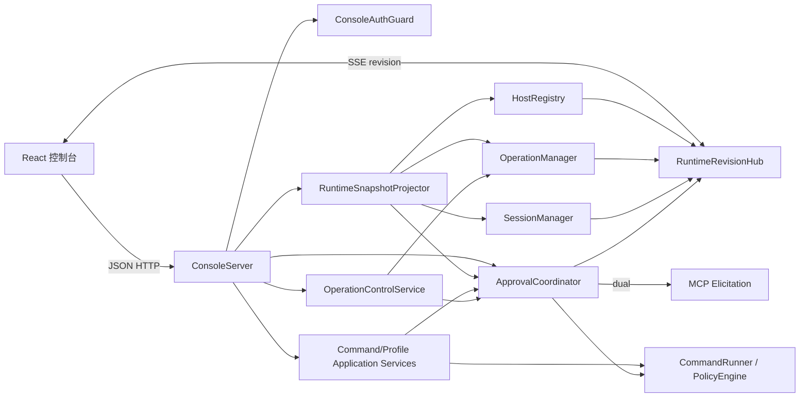

# 技术方案（delta）：SSH MCP 本机实例控制台

> 状态：已确认（2026-07-22）。后续任务拆解与实现应以本设计及已确认规格为准。

## 背景 / 目标与非目标

本设计实现已确认的 [SSH MCP 本机实例控制台规格](../specs/2026-07-22-ssh-mcp-local-console-spec.md)，在现有 Node.js `stdio` MCP 服务内增加一个与进程同生命周期、只监听回环网络的控制台。

技术目标：

- 每个 SSH MCP 进程同时运行一个独立的本机 HTTP 控制台，并输出自己的访问地址。
- 复用现有 `HostRegistry`、`OperationManager`、`SessionManager`、`PolicyEngine`、`CommandRunner`、SSH 主机信任和错误契约，不建立第二套执行内核。
- 浏览器通过受限 JSON HTTP 接口提交动作，通过 SSE 接收状态失效通知；所有状态最终以服务端内存为准。
- MCP 来源审批由网页与 MCP 客户端竞争处理，首个决定唯一生效；网页来源操作只在网页内确认。
- 保持 MCP 工具名、输入输出契约、`stdio` 纯净性和既有 SSH 安全边界。

非目标：

- 不增加浏览器终端、网页文件传输、网页多主机命令、远程访问、跨实例聚合、用户/角色、数据库或历史持久化。
- 不把 MCP 改成 HTTP Transport；新增 HTTP 只服务随进程分发的本机控制台。
- 不提供可供第三方集成的通用业务 API。

## 现状（仅列本次改动触及的部分）

现状来源：对启动、审批、操作、会话、SSH 连接、策略、日志、前端构建和测试路径进行有限但针对性的代码扫描；未生成全仓库调研报告。

- `src/server.ts` 负责加载配置、组装所有管理器和工具、连接 `StdioServerTransport`，并返回统一 `ServerRuntime`。
- `src/index.ts` 只处理启动与 `SIGINT`/`SIGTERM` 关闭。
- `ApprovalService` 目前只请求 MCP form elicitation；客户端不支持时立即失败。其 `OperationIntent` 已有深冻结、规范 JSON、SHA-256 摘要和一次性消费保护，是双通道审批应继续复用的安全核心。
- `OperationManager` 是操作状态和输出的事实源，但目前没有全量只读列表，也没有向全局订阅者发布输出变化或取消已请求状态。
- `SessionManager` 是交互会话事实源，但目前只有按 ID 查询，没有只读列表。
- `HostRegistry.list()` 已提供符合主规格的安全主机摘要；连接变化由 `ConnectionTrackingSshAdapter` 观察。
- `ProfileRun` 直接使用冻结的 `PolicyEngine` 与 `ProfileCompiler` 执行已匹配低风险 Profile；网页需要在此基础上增加更严格的预览确认，而不能放宽策略。
- `web/` 是 React + Vinext + Cloudflare Worker 的演示站点，包含硬编码主机和操作；它未连接真实运行时，并带有本功能不需要的 Next、Cloudflare、D1/Drizzle 和站点托管模板。
- 根测试使用 Vitest，已有单元、MCP 契约、验收及 Linux/Windows OpenSSH 集成层；前端目前只有构建后 HTML 静态检查。

## 技术决策探针

| 决策维度 | 判定 | 结论 |
|---|---|---|
| 数据模型 | 需决策（重大） | 仅增加进程内审批记录、控制台投影和修订号；不增加数据库 |
| 接口契约 | 需决策（重大） | 使用受限 `/api/v1` JSON HTTP + SSE，不向浏览器暴露 MCP Transport |
| 状态管理 | 需决策（重大） | 既有管理器继续作为事实源；控制台只做安全投影与失效通知 |
| 错误与失败 | 需决策 | 统一安全错误 envelope、HTTP 状态映射、启动回滚与有界关闭 |
| 并发与一致性 | 需决策（重大） | `ApprovalCoordinator` 单点仲裁；同步 compare-and-set 保证首个决定生效 |
| 性能与规模 | 需决策（常规） | 沿用现有 10 主机、32 活动操作、64 记录预算；SSE 只发失效通知，不推送大输出 |
| 安全与权限 | 需决策（重大） | 随机 `*.localhost` 实例源 + URL 片段引导 + HttpOnly 严格同站会话 + 来源校验 |
| 可观测性 | 需决策（常规） | 扩展结构化安全事件；仅一次输出访问 URL，不记录命令、令牌或原始输出 |
| 迁移与兼容 | 需决策（brownfield） | MCP 工具契约保持；修改审批能力降级与“禁止网页”验收；不改 YAML schema |
| 测试策略与 seam | 需决策 | 注入 HTTP server、时钟、ID、令牌和 MCP 审批端口；Vitest + `happy-dom` |
| 外部依赖与选型 | 已由用户确认 | React + Vite；新增 `happy-dom` 开发依赖；不引入 HTTP/WebSocket/状态管理框架 |

## 关键技术决策（Decisions）

### Decision 1：控制台与 MCP 运行在同一个 Node.js 进程

- 候选 A（选定）：在 `startServer()` 组装的同一运行时内启动 Node.js HTTP server。
- 候选 B：由 MCP 进程再拉起独立前端/桥接子进程。
- 取舍：A 可直接读取现有内存事实源，生命周期、取消和审批仲裁不需要跨进程协议；缺点是 HTTP 故障必须纳入主进程关闭纪律。B 提供进程隔离，但需要新的 IPC、认证、同步和故障恢复协议，明显超出单实例控制台范围。
- 理由：规格要求页面与单个 MCP 进程严格绑定，并在进程退出后立即失效；同进程是最小且最可靠的实现。

### Decision 2：前端改为 React + Vite 静态客户端

- 候选 A（选定，用户确认）：保留 React 组件与现有视觉样式，使用 Vite 生成静态 `index.html`、JS 和 CSS，由 Node.js 进程提供。
- 候选 B：保留 Vinext/Cloudflare SSR 与 Worker handler。
- 候选 C：改写为原生 DOM 应用。
- 取舍：A 复用现有界面和 React 状态模型，同时删除与本机控制台无关的托管运行层；B 会把 Cloudflare 运行模型带入 Node MCP；C 运行依赖最小，但需要重写界面并自行维护复杂交互状态。
- 理由：Vite 官方生产构建直接输出可静态托管资源，符合本机内嵌服务模型；React 适合审批弹窗、操作列表与多状态交互。
- 依据：[Vite 生产构建](https://vite.dev/guide/build)、[Vite 后端集成](https://vite.dev/guide/backend-integration.html)、[React `createRoot`](https://react.dev/reference/react-dom/client/createRoot)。

### Decision 3：动作使用 JSON HTTP，状态变化使用 SSE

- 候选 A（选定，用户确认）：状态快照与动作走短 HTTP 请求，SSE 只发布修订号和失效类别。
- 候选 B：全部使用 WebSocket 请求/响应协议。
- 候选 C：浏览器定时轮询。
- 取舍：A 使用浏览器原生重连语义，单向推送与本项目“服务端状态变化、浏览器偶发动作”完全匹配，并可用 Node.js 内置 HTTP 实现。B 需要请求关联、心跳、重连、背压和额外安全协议；C 简单但审批与输出延迟更大且产生重复流量。
- 理由：SSE 不承载命令和大输出，只通知客户端重新读取权威状态；这使重连无需事件重放，也避免在实时通道实现第二套 RPC。
- 依据：[Node.js v24 HTTP](https://nodejs.org/download/release/latest-v24.x/docs/api/http.html)、[MDN SSE](https://developer.mozilla.org/en-US/docs/Web/API/Server-sent_events/Using_server-sent_events)。

### Decision 4：每个实例使用独立 `*.localhost` Origin 和片段引导会话

- 候选 A（选定，用户确认）：生成随机实例主机名与独立访问令牌；启动 URL 为 `http://<instance-id>.localhost:<port>/#access_token=<token>`。页面将 token 交换为 host-only、`HttpOnly; Secure; SameSite=Strict; Path=/` 的非持久 Cookie，然后立即从地址栏移除片段。
- 候选 B：把 token 放在查询参数或每个请求 URL 中。
- 候选 C：把 token 存入 `localStorage`/`sessionStorage` 并作为 Bearer header 发送。
- 取舍：A 避免 token 进入首次 HTTP 请求、服务日志和 Referer；随机子域还使不同实例的 host-only Cookie 隔离，解决 Cookie 不按端口隔离的问题。B 容易在历史和日志中泄露；C 会把长期凭证暴露给同源脚本。
- 理由：`.localhost` 及其子域按标准解析到回环地址，现代浏览器把 `http://*.localhost` 视为可信本机源；配合精确 Host/Origin 校验可同时满足多实例隔离和无登录页体验。
- 依据：[RFC 6761](https://www.rfc-editor.org/info/rfc6761/)、[MDN URI Fragment](https://developer.mozilla.org/en-US/docs/Web/URI/Reference/Fragment)、[OWASP Session Management](https://cheatsheetseries.owasp.org/cheatsheets/Session_Management_Cheat_Sheet.html)、[MDN Secure Contexts](https://developer.mozilla.org/en-US/docs/Web/Security/Defenses/Secure_Contexts)。
- 假设：首批支持对象是能正确处理 `*.localhost`、Secure localhost Cookie、CSP 和 SSE 的现代常青浏览器；具体最低版本在兼容性验证后写入 README。

### Decision 5：浏览器只访问受限控制台 API，不复用或代理 MCP Transport

- 候选 A（选定）：定义只覆盖规格能力的 `/api/v1` 接口；HTTP handler 调用应用服务和现有管理器。
- 候选 B：在浏览器中实现 MCP 客户端并把完整 MCP 工具面暴露为 HTTP。
- 取舍：A 的可达能力天然受接口白名单约束，不会意外开放会话输入、文件传输或多主机命令；B 能复用工具 schema，但会增加第二个 MCP Transport、扩大攻击面并难以落实网页专属审批语义。
- 理由：控制台是进程内产品入口，不是通用 MCP 网关；受限 API 更容易逐条证明 MUST NOT。

### Decision 6：用统一 `ApprovalCoordinator` 仲裁网页与 MCP 客户端

- 候选 A（选定）：把现有 `ApprovalService` 提升为统一协调器。所有待审批项形成一个有界内存记录；浏览器、MCP elicitation、超时、关闭和取消都只能调用同一个 `settle()`。
- 候选 B：保留当前 MCP 审批服务，再增加独立网页审批服务，由调用方竞争两个 Promise。
- 取舍：A 的决定状态和副作用回调只有一个所有者，可同步检查 `pending` 后立即转为终态；B 会复制超时、终止和 Operation 状态处理，容易出现两个通道都执行副作用。
- 理由：Node.js 单事件循环中，无 `await` 的 `pending → resolved` compare-and-set 是原子临界区；配合现有 `consumeVerifiedOperationIntent()`，即使回调重复或竞态，也至多消费一次精确意图。

### Decision 7：审批路由显式随执行上下文传播

- 候选 A（选定）：定义 `ApprovalRoute = "dual" | "web_only"`，从应用服务显式传给命令运行器、SSH 连接和主机指纹确认。
- 候选 B：用全局变量或 `AsyncLocalStorage` 隐式推断当前请求来源。
- 取舍：A 需要给少量内部函数增加参数，但调用关系可审查、测试可注入；B 改动表面较少，却把安全决定隐藏在异步上下文中，容易在并行连接时串路由。
- 理由：MCP 来源命令及其 TOFU 确认使用 `dual`；网页来源命令/Profile 及其 TOFU 确认使用 `web_only`。会话和文件传输仍只来自 MCP，默认 `dual`。

### Decision 8：权威快照 + SSE 失效通知，不维护浏览器事件日志

- 候选 A（选定）：管理器发布变化给 `RuntimeRevisionHub`；SSE 只发送递增 revision 和类别；浏览器重新取得安全快照，打开操作详情时用现有输出 cursor 增量读取。
- 候选 B：SSE 直接发送完整快照与全部输出帧，并为断线保留事件日志。
- 取舍：A 不复制 Operation 输出缓冲和保留策略，断线恢复永远回到现有事实源；B 减少一次 GET，但引入第二份大状态、事件重放游标和敏感输出缓存。
- 理由：现有 OperationManager 已处理输出截断、游标和记录过期；控制台只应投影，不应成为第二个状态存储。

### Decision 9：前端交互测试使用 Vitest + `happy-dom`

- 候选 A（选定，用户确认）：React 组件和 reducer 在 `happy-dom` 中测试；Node HTTP 契约测试覆盖网络行为。
- 候选 B：引入 Playwright 与 Chromium 做真实浏览器端到端测试。
- 取舍：A 只增加一个轻量开发依赖，跨 Linux/Windows CI 稳定；B 浏览器保真度更高，但引入浏览器下载和更重的 CI 维护。
- 理由：安全边界在 Node 契约层验证；前端主要验证焦点、键盘、状态收敛和“不提供入口”。真实浏览器兼容性作为发布前人工矩阵，而非本版持续测试依赖。

### 常规决策

- HTTP 实现：使用 `node:http`，不引入 Express/Fastify —— 路由少、输入严格且无需插件生态。
- 监听：只绑定 IPv4 `127.0.0.1`，端口传 `0` 由操作系统分配 —— 多实例天然避开端口冲突，不新增配置项。
- 静态资源：Vite 输出到 `dist/console/`；服务启动时读取并冻结允许文件清单 —— 避免运行时任意路径拼接与目录穿越。
- 前端状态：React `useReducer` + 小型 `ConsoleClient`，不引入 Redux/Zustand —— 状态来源单一且规模有界。
- 输入校验：HTTP JSON schema 继续使用根项目已有 Zod —— 保持 MCP 与网页参数验证风格一致。
- Cookie：不设置 `Domain` 或持久期限；随机 `*.localhost` host-only Cookie 隔离实例，不使用 Web Storage。
- CSRF/本机跨站防护：无 CORS；所有写操作只接受 JSON、自定义请求头和精确 Origin；同时校验 Host、Fetch Metadata 和回环 socket。
- 页面安全：严格 CSP、`frame-ancestors 'none'`、`Referrer-Policy: no-referrer`、`X-Content-Type-Options: nosniff`、`Cache-Control: no-store`；命令与输出只进入文本节点。
- HTTP 动作：GET/HEAD 永不产生副作用；重复确认、重复取消和过期预览返回当前结果或稳定冲突错误。
- 可观测：增加 `console.ready`、`console.request_rejected`、`console.stopped` 等稳定事件；控制台监听失败使用稳定业务错误码，并仅在白名单内保留 `EPERM` 等系统错误码；不记录原始错误消息、路径、stack、访问 token、Cookie、命令、Profile 参数或输出。

## 改动设计

### 组件与职责



新增或调整的模块边界：

- `ConsoleServer`：监听、静态资源、严格路由、HTTP 预算、安全 header、会话交换和有界关闭；不包含 SSH 业务逻辑。
- `ConsoleAuthGuard`：生成实例 ID/token、常量时间校验 token/Cookie、验证 Host/Origin/Fetch Metadata/回环地址。
- `RuntimeRevisionHub`：维护单调递增 revision、合并同一事件循环内重复失效、管理有界 SSE 订阅，不存储业务数据。
- `RuntimeSnapshotProjector`：从事实源创建白名单字段快照；不直接展开配置、Operation result 或内部 Error。
- `ApprovalCoordinator`：保存有界审批记录、创建 MCP elicitation、接收网页决定、处理超时/关闭、唯一调用副作用回调。
- `CommandApplicationService`：统一 MCP 与网页原始命令的主机解析、Intent 创建和 `CommandRunner` 启动；传入审批路由。
- `ProfileApplicationService`：统一 Profile 列表安全投影、策略验证、编译和运行；MCP 低风险路径保持自动执行，网页路径先进入 `web_only` 审批。
- `OperationControlService`：取消时先判断操作是否仍由 `ApprovalCoordinator` 持有；待审批项由协调器取消，运行项交给 `OperationManager.cancel()`。
- `OperationManager`：增加不改变 MCP 输出契约的控制台只读投影与全局 change hook；投影包含取消请求状态和安全元数据。
- `SessionManager`：增加安全只读 `list()` 与 change hook；不增加网页写入口。
- React 控制台：用真实快照替换硬编码数组，提供总览、主机、操作详情、待审批、单次命令和 Profile 表单；会话/传输仅展示摘要。

### 启动与关闭数据流

启动与按需激活采用分阶段提交：

1. 加载并冻结配置，组装既有事实源、应用服务和审批协调器。
2. 连接 MCP `stdio` transport，写入 `service.started`；此时不加载前端资产、不建立 HTTP listener。
3. 首次合法工具调用通过进程级 gate 检查客户端 form elicitation 能力，并只询问一次是否启用控制台。
4. 用户接受后才加载资产、生成实例 ID 与访问 token，并由 `ConsoleServer` 在 `127.0.0.1:0` 建立 listener。
5. 控制台可用后写入一次性的 `console.ready`；客户端支持 URL elicitation 时，再通过标准协议请求客户端向用户呈现导航确认，用户接受后由客户端打开页面。客户端未声明 URL elicitation 或导航请求失败时，进程级 gate 把同一个一次性地址写入首次工具 structuredContent 的 `_sshMcp.console.accessUrl`；server instructions 要求客户端把它展示为链接。
6. 控制台激活失败只产生稳定告警并附加到首次工具文本结果，不回滚或中断已可用的 MCP `stdio`。

关闭顺序：

1. 控制台进入 quiescing，拒绝新审批、取消和执行请求，并向 SSE 页面发布 offline。
2. `ApprovalCoordinator.shutdown()` 取消 MCP elicitation、使所有 pending 项失败关闭，保证未批准副作用为零。
3. 现有 Operation/Session 按既有截止时间尝试停止，SSH adapter 关闭连接。
4. MCP server 关闭；SSE response 与 HTTP keep-alive socket 被有界终止；HTTP listener 关闭。
5. 清除 token、审批记录和投影引用。重复 `shutdown()` 返回同一个 Promise。

若已成功启动的 HTTP listener 在运行期发生不可恢复错误，控制台触发整个 `ServerRuntime.shutdown()`；激活阶段的监听失败则降级为纯 `stdio`，不会关闭 MCP。

### 审批仲裁数据流

`ApprovalCoordinator.request()` 创建冻结记录和一次性副作用闭包：

```ts
type ApprovalRoute = "dual" | "web_only";
type ApprovalAction = "accept" | "decline" | "cancel";
type ApprovalState = "pending" | "accepted" | "declined" | "cancelled" | "timed_out" | "failed";

interface ApprovalRecord {
  readonly approvalId: string;
  readonly operationId?: string;
  readonly route: ApprovalRoute;
  readonly kind: "operation" | "host_trust";
  readonly digest: string;
  readonly safeView: Readonly<Record<string, unknown>>;
  readonly createdAt: number;
  readonly expiresAt: number;
  state: ApprovalState;
  resolvedBy?: "web" | "mcp" | "timeout" | "shutdown";
}
```

- `dual`：记录创建后立即进入网页快照；若 MCP 客户端声明 form elicitation，同时发起一个可中止的 MCP 请求。客户端不支持时只等待网页，不提前失败。
- `web_only`：记录只进入网页；不得调用 MCP `elicitInput()`。
- 所有来源调用同步 `settle(record, action, source)`。只有 `state === "pending"` 的第一个调用可以改变状态；检查与赋值之间没有 `await`。
- 首个接受者成功转换状态后，协调器再次验证并消费 `OperationIntent`，然后只调用一次副作用闭包；后续决定得到 `already_resolved`。
- 网页先决定时中止仍挂起的 MCP elicitation；MCP 先决定时通过 revision 使网页立即显示 `resolvedBy: "mcp"`。
- 拒绝、取消、超时、shutdown 都不调用副作用。解析或执行阶段抛出异常时沿用现有保守 `unknown`/`sideEffects` 规则。
- resolved 记录只保留到现有 `resultRetentionMs`，用于其他标签页显示“已处理”；不写磁盘。

TOFU 主机指纹确认复用同一协调器。`ApprovalRoute` 从命令/Profile 应用服务显式传入 `CommandRunner` 和 `SshAdapter.connect()`，再由 `HostKeyVerificationContext` 交给 `TrustConfirmation`：

- MCP 来源命令、Session、Transfer、低风险 Profile：`dual`。
- 网页来源命令和 Profile：`web_only`。
- 指纹变化继续严格拒绝，不创建可绕过的审批记录。

### 状态与输出同步

事实源不变：

- 主机状态：`HostRegistry`。
- 操作状态、进度与输出：`OperationManager`。
- 会话状态：`SessionManager`。
- 审批状态：`ApprovalCoordinator`。
- Profile 定义：冻结的 `PolicyEngine`/配置安全投影。

`RuntimeSnapshotProjector` 输出：

```ts
interface RuntimeSnapshot {
  readonly instanceId: string;
  readonly revision: number;
  readonly serviceState: "active" | "quiescing";
  readonly hosts: readonly HostSummary[];
  readonly operations: readonly ConsoleOperationSummary[];
  readonly sessions: readonly SessionSnapshot[];
  readonly approvals: readonly ConsoleApprovalView[];
  readonly profiles: readonly ConsoleProfileSummary[];
}
```

投影规则：

- Operation 只包含 ID、来源、类型、目标别名、状态、取消是否已请求、时间、截断标记和白名单进度字段；不展开任意 `result` 或 Error cause。
- Session 只包含现有安全 `SessionSnapshot`；不包含输出帧或输入入口。
- Transfer 作为 Operation 的只读类型展示，只投影字节数/项目数和状态，不提供源/目标路径动作。
- Profile 列表只给 ID、平台、允许主机和参数 schema；完整编译命令只在生成一次性网页预览后返回。
- Operation 输出通过独立 cursor endpoint 读取，直接沿用现有最大读取范围、截断和过期错误；前端始终用 `textContent`/React 文本插值呈现。

每次 SSE 连接成功先发送 `ready`（含当前 revision），浏览器随后 GET 权威快照。变化事件只含 `revision` 与 `scope`；浏览器按 revision 去重并重新取快照。断线时 reducer 立即切换为 `disconnected` 并禁用写动作；重连完成 `ready + snapshot` 后才恢复。

## HTTP 接口契约

所有路径均为当前随机 `*.localhost` Origin 下的实例私有接口；除静态 shell 与会话交换外均要求有效 HttpOnly Cookie。

| 方法与路径 | 用途 | 输入 / 输出要点 |
|---|---|---|
| `GET /`、`GET /assets/*` | 静态 React 客户端 | 只服务构建清单内文件；无实例数据 |
| `POST /api/v1/session` | 片段 token 换会话 Cookie | JSON `{ accessToken }`；成功 `204`，不回显 token |
| `GET /api/v1/snapshot` | 权威安全快照 | 返回 `RuntimeSnapshot` |
| `GET /api/v1/events` | SSE revision | `ready`、`invalidated`、`offline`；不承载命令输出 |
| `GET /api/v1/operations/:id/output` | 增量输出 | `cursor`、`maxBytes`；返回 frames/nextCursor/truncated |
| `POST /api/v1/previews/command` | 创建网页命令预览 | 单主机 + command；返回 approvalId、完整意图、digest、期限 |
| `POST /api/v1/previews/profile` | 创建网页 Profile 预览 | 单主机 + profileId + parameters；返回实际命令与 digest |
| `POST /api/v1/approvals/:id/decision` | 网页决定 | `{ action, expectedDigest }`；返回唯一 Resolution |
| `POST /api/v1/operations/:id/cancel` | 请求取消 | 返回 cancel-requested 或既有终态 |

不提供 generic tool call、Session 写/resize/close、文件上传下载、多主机目标或配置读写 endpoint。

统一错误 envelope 复用安全的 MCP error 字段：

```ts
interface ConsoleErrorResponse {
  readonly error: {
    readonly code: string;
    readonly finalState: "failed" | "timed_out" | "unknown";
    readonly retriable: boolean;
    readonly sideEffects: "none" | "possible" | "partial" | "confirmed";
    readonly operationId?: string;
    readonly details?: Readonly<Record<string, string | number | boolean>>;
  };
}
```

HTTP 映射：无效输入 `400`；缺失/错误会话 `401`；来源/Host 不符 `403`；未知对象 `404`；已过期 `410`；意图摘要不匹配或已由另一端决定 `409`；请求体过大 `413`；资源预算耗尽 `429`；quiescing/不可用 `503`。响应不包含 stack、配置路径、原始异常消息或凭据。

## 本机 Web 安全设计

### Origin 与会话

- 实例 ID 和 token 分别使用密码学安全随机值；token 至少 256 bit，比较使用固定长度摘要和 `timingSafeEqual`。
- listener 只绑定 `127.0.0.1`，并再次检查 socket 对端是回环地址。
- `Host` 必须精确等于当前 `<instance-id>.localhost:<assigned-port>`；不信任 `X-Forwarded-*`，不支持反向代理。
- 浏览器首次加载静态 shell 后，从 fragment 读取 token，以同源 JSON POST 交换 Cookie；成功后用 `history.replaceState()` 清除 fragment。
- Cookie 不设置 `Domain`、`Expires` 或 `Max-Age`；使用 `HttpOnly; Secure; SameSite=Strict; Path=/`。实例随机子域确保不同进程的 Cookie 不共享。
- 服务端只保存 token 摘要，不把 token 放入普通日志、API 响应、HTML、JS bundle 或持久存储。完整访问 URL 优先通过一次性的 `console.ready` 诊断事件及客户端明确声明支持的 URL elicitation 请求传递；客户端缺少该能力时，允许作为兼容回退附加到首次工具 structuredContent 一次。该回退会进入模型上下文，因此只使用页面会话交换后立即失效的一次性 token，并明确禁止分享或持久化。

### 请求防护

- 不发送任何 CORS 允许 header；预检和跨源请求默认失败。
- 所有写 endpoint 要求精确 `Origin`、`Sec-Fetch-Site` 为 `same-origin`、`Content-Type: application/json` 和固定自定义 header；缺少现代 Fetch Metadata 时仍必须通过 Origin。
- GET/HEAD handler 纯只读；不接受 `_method`、表单编码、text/plain 或 JSONP。
- JSON body、header 数量、URL 长度、并发 SSE 和 keep-alive request 数量均设固定上限；超限关闭请求而不分配业务对象。
- CSP 至少为 `default-src 'none'; script-src 'self'; style-src 'self'; img-src 'self'; connect-src 'self'; frame-ancestors 'none'; base-uri 'none'; form-action 'none'`。
- Vite 不生成 inline script；所有资源使用同源哈希文件。页面无外部字体、分析、CDN、图片代理或 Service Worker。

### 页面数据安全

- 删除原型中 endpoint、username、认证方式、允许根和“查看配置”等超出 `hosts_list` 安全摘要的展示。
- 删除硬编码活动、账户头像和“今日操作”等伪状态；所有数值来自快照。
- 命令、Profile 实际命令、主机别名、远程输出和错误都按文本渲染；不使用 `dangerouslySetInnerHTML`。
- API client 不把 token、Cookie、命令、输出或审批写入 Web Storage、IndexedDB、URL query 或控制台日志。

## 错误与失败处理

- **静态资源缺失/损坏**：启动阶段失败并回滚整个运行时；不启动一个无页面的 MCP 实例。
- **端口绑定失败**：使用 port 0 时只可能是系统级失败；报告稳定 console 启动错误并回滚，不自行绑定非回环地址。
- **会话交换失败**：统一 `401`，不区分 token 缺失、长度错误或摘要不匹配，避免凭证探测。
- **SSE 断开**：服务端清理订阅；客户端禁用写动作并依赖原生重连，重连后取全量快照，不重放动作。
- **请求在响应前断开**：未完成验证/预览的请求不创建业务对象；已经由协调器接受的决定按服务端状态继续，客户端重连后查询结果，不能自动重试接受动作。
- **MCP elicitation 失败**：若审批仍 pending，网页仍可在原期限内处理；若网页已经决定，MCP 失败只是 losing channel，不改变结果。
- **审批竞态**：后到者得到 `409 already_resolved` 与安全 resolution；不重新执行闭包。
- **审批超时/关闭**：协调器首先结算 pending，再让 OperationManager 收敛，避免超时后迟到接受。
- **取消竞态**：运行中记录保留 `cancelRequested`，最终仍由现有远程停止证据决定 `cancelled/completed/failed/unknown`。
- **快照投影异常**：单个非法内部记录不把原始值发给浏览器；记录稳定内部错误并对该项显示通用失败，不能放宽白名单投影。
- **HTTP server 运行期致命错误**：触发统一 runtime shutdown；不自动另开端口或重启页面。

## 迁移与兼容

### MCP 行为

- 保持 12 个 MCP 工具的名称、输入 schema 和现有成功/错误结果结构。
- `command_run` 的内部逻辑迁入 `CommandApplicationService`，MCP handler 仍是薄适配器。
- `profile_run` 继续对完整匹配的低风险 Profile 自动执行；只有网页来源 Profile 增加更严格的网页确认。
- 修改“客户端不支持 form elicitation”的路径：不再立即返回 `APPROVAL_UNSUPPORTED`，而是在相同 approval timeout 内等待网页；两端都不可用时返回稳定审批失败/超时。
- 主机首次 TOFU 也进入协调器；指纹变化严格拒绝行为不变。
- `operation_get`/`operation_cancel` 对外 schema 保持；控制台专用列表与取消投影不直接加入 MCP structuredContent。

### 启动、配置和日志

- 不修改 YAML 配置 schema；本版端口、Origin 和 token 均自动产生，避免新增可误配的远程监听选项。
- `startServer()` 保留可注入的 `ConsoleServerFactory` test seam；生产只在首次工具调用获准后创建真实 listener，既有测试可注入内存 fake。
- `ServerRuntime.shutdown()` 纳入控制台并继续幂等、有界。
- 日志白名单增加 console 生命周期事件和经过严格格式校验的单次访问 URL 字段；普通 details 仍不能携带 URL/token。
- 更新既有 MN-007 验收：允许唯一的本机 Console HTTP 模块，但继续禁止 MCP HTTP Transport、通用业务 API、远程监听和其他启动命令。

### 前端与构建

- `web/` 转为 Vite React 静态工作区；入口使用 `createRoot()`，不再使用 Next App Router、Vinext 或 Cloudflare Worker。
- 删除 Cloudflare/D1/Drizzle/Sites/Next 专属代码与依赖；现有纯 CSS 和 React 视觉结构按规格保留。
- Tailwind 只用于当前 CSS import，本方案移除该 import 并保留普通 CSS，因此不再需要 Tailwind/PostCSS 运行链。
- 根 npm workspace 统一安装与锁定 root + `web` 依赖；生产构建先生成 `dist/console/`，再编译 `dist/*.js`。运行 `node dist/index.js` 不需要单独安装或启动前端。
- `npm run check` 成为统一入口，覆盖后端 build/typecheck/tests 和前端 build/typecheck/component tests；CI 仍只需根目录一次 `npm ci`。

不存在数据/schema 迁移。回滚到旧版本只需使用旧构建产物；旧版本不会读取或恢复控制台内存状态。

## 测试策略

### 测试接缝

- `ConsoleServer` 注入 asset provider、token/instance ID factory、clock 和底层 listener factory。
- `ApprovalCoordinator` 注入 MCP approval port、clock、ID factory 与 OperationManager；副作用使用计数闭包验证至多一次。
- `RuntimeRevisionHub` 注入调度器；测试可同步触发 coalescing 和断线。
- `CommandApplicationService` 注入 registry、approval coordinator、runner；不需要真实 SSH 即可测试预览与 route。
- React 组件只依赖 `ConsoleClient` 接口；`happy-dom` 中使用 fake client 驱动快照、断线、审批和键盘事件。

### 单元测试

- token/实例 ID 格式、固定时间比较、Cookie 属性、Host/Origin/Fetch Metadata/回环校验及失败不泄露。
- `ApprovalCoordinator` 覆盖 web-first、MCP-first、accept/decline/cancel 交叉竞态、超时、shutdown、客户端不支持、摘要不匹配和副作用抛错；每例断言副作用次数 `0` 或 `1`。
- `OperationControlService` 覆盖 pending 取消、running 取消、重复取消和终态取消。
- Snapshot 投影覆盖字段白名单、稳定排序、空态、截断、过期、Session/Transfer 只读摘要和敏感字段排除。
- revision 合并、递增、订阅释放和 SSE 客户端预算。
- 命令/Profile 预览覆盖单主机、空命令、非法参数、实际编译命令、变更后 digest 失效和 route 传播。

### HTTP/SSE 契约测试

- 真实 `node:http` listener 使用随机 `*.localhost` Host 发请求；覆盖静态资源、会话交换、安全 header、无/错/跨实例 Cookie、来源错误、body 限制和所有 API method/path 白名单。
- 同时启动两个 ConsoleServer，交换各自 token，交叉发送 Host/Cookie/approvalId/operationId，证明完全隔离。
- SSE 覆盖 ready、revision、offline、断开清理、重连后快照和输出 cursor，不要求事件重放。
- 子进程启动测试先证明启动阶段只有 `stdio`，再在首次工具调用接受启用后从 stderr `console.ready` 取得 URL；stdout 始终只有 MCP JSON-RPC 帧，进程退出后旧地址不可访问。
- MCP 客户端不声明 form elicitation时，真实调用保持 pending，随后网页批准可执行；网页不决定则超时且副作用为零。

### React 组件测试（Vitest + `happy-dom`）

- 无 token/会话、连接中、在线、断线、空态和实例退出状态。
- 审批弹窗焦点进入、焦点圈定、Escape 取消、关闭后焦点返回、全键盘接受/拒绝/取消。
- 命令/Profile 预览完整展示、变更后旧确认失效、断线时写入口禁用。
- MCP 先处理后网页显示 resolved、多标签页快照收敛的 reducer 行为。
- 所有状态有文字标签，不只依赖颜色；关键控件具有可访问名称。
- 源码级禁止检查：无终端输入、文件选择/拖放、多主机提交、配置管理、外部 URL、Web Storage 或 `dangerouslySetInnerHTML`。

### 现有回归与集成

- 现有 unit/contract/acceptance 全量通过；更新受新规格明确修改的旧断言，不放宽其他 MUST NOT。
- Linux/Windows OpenSSH 命令、Profile、Session、Transfer 和 TOFU 集成继续通过，证明显式 route 未改变 MCP 路径。
- 新增网页命令的 Linux/Windows 集成至少覆盖单次命令、输出、取消和首次 TOFU；网页不增加 Session/Transfer 写集成。

## 风险与权衡

- **访问 URL 本身是能力凭证**：任何能读取 stderr 或用户复制内容的人都可在实例生命周期内操作。缓解：只输出一次、不进普通日志、不持久化、进程退出即失效；这是用户已确认的无登录边界。
- **HTTP 而非自签名 HTTPS**：回环 listener 避免网络窃听，随机 `*.localhost` 属可信本机 Origin；自签名证书会引入安装与信任管理，不符合无配置目标。仍必须依赖 token、精确 Origin 和 CSP，而不能把 localhost 当授权。
- **现代浏览器差异**：`*.localhost`、Secure Cookie 与 SSE 的实际组合需在 Chrome/Edge、Firefox、Safari 做发布前人工矩阵。若某目标浏览器不支持，不能静默退回查询 token 或 Web Storage；应先修订兼容范围/设计。
- **MCP 客户端 UI 能力有限**：网页先决定后，服务端可以中止 MCP elicitation，但客户端如何文案展示由客户端实现决定。服务端保证请求结束和工具调用取得唯一结果，不能保证第三方客户端显示“由网页处理”的精确措辞。
- **高频输出**：SSE 不传输出，只发合并失效；详情页按 cursor 读取，因此不会复制 8 MiB buffer。仍需限制 SSE 订阅数和快照请求频率，防止本机资源耗尽。
- **审批协调器改动核心安全路径**：这是本设计最高风险点。通过纯状态机、同步 settle、一次性 Intent 消费、注入式竞态测试和保留现有保守错误语义降低风险。
- **前端原型清理可能与未提交工作重叠**：实施时必须先核对工作树，逐文件保留用户已有更改；不能用生成器覆盖整个 `web/`。

## 需求覆盖核对

| Spec 条目 | 设计落点 |
|---|---|
| Requirement：实例启动与关闭 | 同进程 ConsoleServer、分阶段提交、启动回滚、统一有界 shutdown |
| Requirement：本机访问保护 | 随机 `*.localhost`、回环 bind、fragment token、HttpOnly Cookie、AuthGuard |
| Requirement：实例状态总览 | RuntimeSnapshotProjector + Host/Operation/Session/Approval 安全列表 |
| Requirement：操作状态与输出 | Operation 控制台投影、cursor output endpoint、revision 失效通知 |
| Requirement：网页发起操作 | Command/Profile Application Services + `web_only` 审批 + 冻结 Intent |
| Requirement：双通道审批 | ApprovalCoordinator `dual` route、同步 settle、MCP AbortSignal |
| Requirement：网页取消操作 | OperationControlService + cancelRequested 投影 + 现有停止确认状态机 |
| Requirement：实时同步与恢复 | RuntimeRevisionHub、SSE ready/invalidated/offline、重连全量快照 |
| Requirement：安全展示与输入处理 | 白名单投影、Zod、CSP、文本渲染、统一安全错误、无外部请求 |
| Requirement：控制台可用性 | React 中文界面、焦点管理、键盘路径、文字状态、happy-dom 测试 |
| MUST NOT 非回环监听 | 固定 `127.0.0.1:0` + socket/Host 校验；无配置开关 |
| MUST NOT 仅凭本机授权 | 每个受保护请求验证 host-only session token 与来源 |
| MUST NOT 登录/用户/角色 | 单一 capability token；无相关数据模型与 endpoint |
| MUST NOT 服务端直接打开浏览器 | 无系统 open/子进程调用；只在客户端支持时发送需用户同意的 URL elicitation |
| MUST NOT 网页交互终端 | Session 只有只读投影；API/UI 无写、resize、close/open |
| MUST NOT 网页文件传输 | Transfer 只有只读 Operation 投影；无上传/下载 endpoint/input |
| MUST NOT 网页多主机 | Web preview schema 的 host 是单字符串；应用服务拒绝数组 |
| MUST NOT 跨实例聚合 | 随机 Origin/token；Snapshot 只持当前 runtime 引用；交叉测试 |
| MUST NOT 退出后持久化 | 全部新增状态只在内存；无 DB/Web Storage；shutdown 清空 |
| MUST NOT 审计导出/外部通知/遥测 | 无 endpoint、外部 URL、通知依赖或后台请求 |
| MUST NOT 绕过 SSH 安全边界 | 网页调用共享 Application Services/Policy/Runner/Verifier，不直连 ssh2 |
| MUST NOT 污染 MCP stdout | URL 只走结构化 stderr logger、合法 URL elicitation 帧，或 form-only 客户端首次工具的 structuredContent；子进程协议测试持续验证 stdout |

反向核对：设计未增加 Spec 之外的终端、文件写、多主机、配置管理、持久化、远程访问或第三方集成；`/api/v1` 只覆盖明确纳入的控制台行为。

## 待解问题 / Deferred

- 首批明确支持的 Chrome/Edge、Firefox、Safari 最低版本；不阻塞架构，但发布前必须完成人工兼容矩阵。
- HTTP body、SSE 订阅、keep-alive 和静态资源总大小的具体常量；实施时以现有操作预算为上界设定并写入测试，不开放 YAML 配置。
- 控制台显示 Operation 类型的安全元数据字段最终命名；不得改变既有 MCP structuredContent。
- `console.ready` 结构化事件、URL elicitation 与 `_sshMcp.console.accessUrl` 的字段名称及日志脱敏规则；工具结果兼容回退必须保持单次交付。
